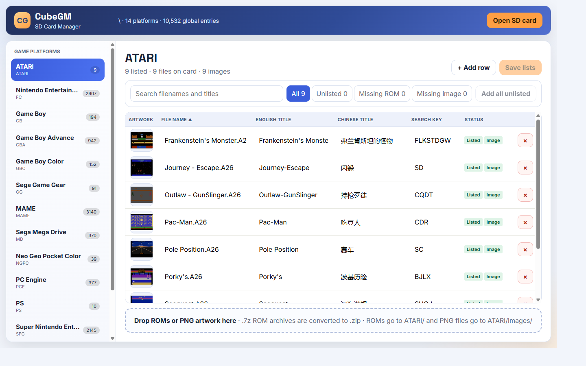

# CubeGM Manager

Web UI for maintaining CubeGM SD card game lists.

CubeGM Manager scans platform folders on the SD card, compares `filelist.csv`
with real ROM files and artwork, and keeps `cubegm/allfiles.lst` in sync.

## How It Works

1. You open the SD card root with the browser File System Access API.
2. The app scans all platform folders containing `filelist.csv`.
3. It builds a live view of:
	- listed games (`filelist.csv`)
	- files actually present in each platform directory
	- available PNG artwork in each `images` folder
4. You can edit list entries, add missing rows, or remove bad entries.
5. Saving writes platform `filelist.csv` and updates `cubegm/allfiles.lst`.

## Key Features

- Sidebar platform browser with human-readable console names.
- Filters for unlisted files, missing ROMs, and missing artwork.
- Sort by filename or status.
- Drag and drop ROM files directly into the selected platform.
- Drag and drop image files onto a row to set artwork.
- `.7z` ROM archives are extracted and stored as `.zip`.
- Progress feedback during convert/write/save operations.

## Typical Workflow

1. Click **Open SD card** and select the card root.
2. Pick a platform in the left sidebar.
3. Fix filenames/titles, or click **Add all unlisted**.
4. Drop ROMs into the drop area (or images onto specific rows).
5. Click **Save lists**.

## Requirements

- Desktop Chrome/Edge (File System Access API required).
- Read/write permission to the SD card root.
- For GitHub Pages usage, network access is required for CDN-loaded JS modules.

## AI Usage Note

This project was developed with AI-assisted coding support.

- AI was used to speed up UI iteration, refactoring, and workflow setup.
- File format assumptions and destructive operations should always be manually verified.
- Before release, test on a real SD card backup and review generated changes in Git.

## Screenshots

### One-time setup in GitHub

1. Open repository settings.
2. Go to **Pages**.
3. Set **Source** to **GitHub Actions**.

After that, every push to `master` will publish the page.
